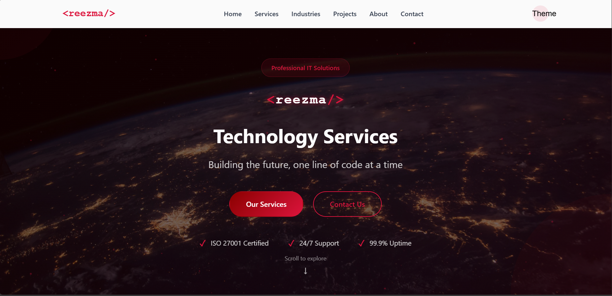
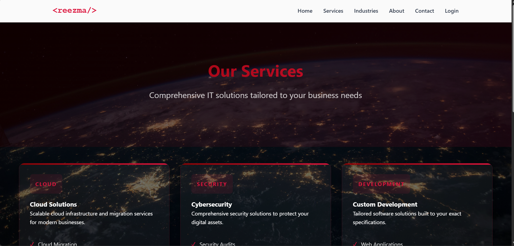
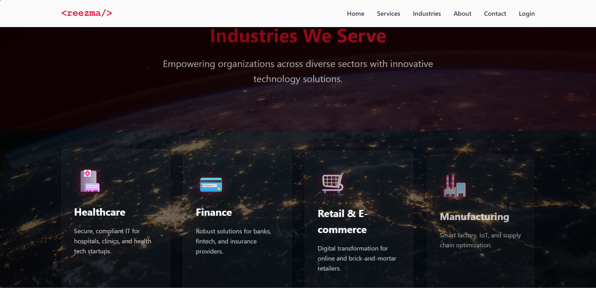
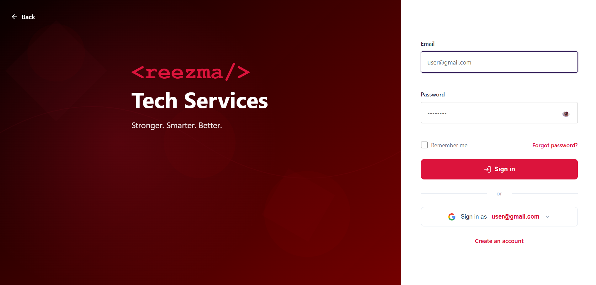
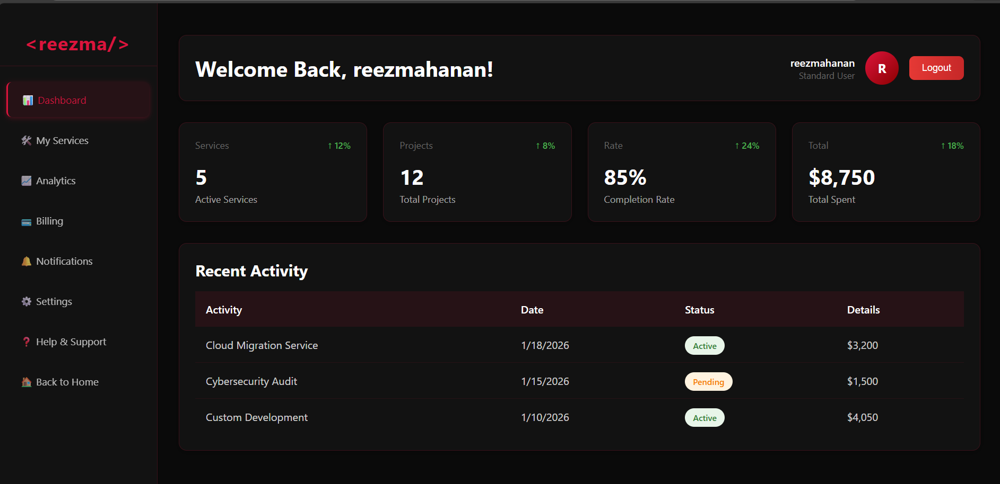
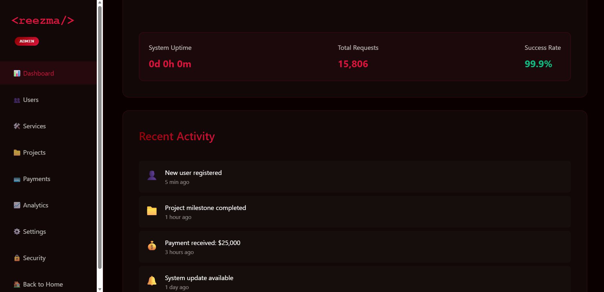
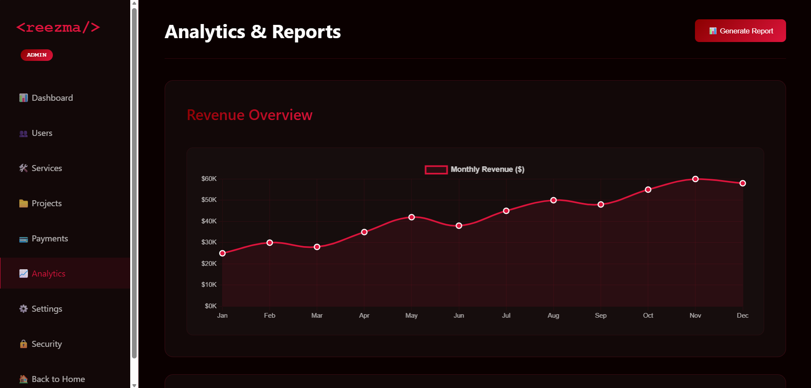
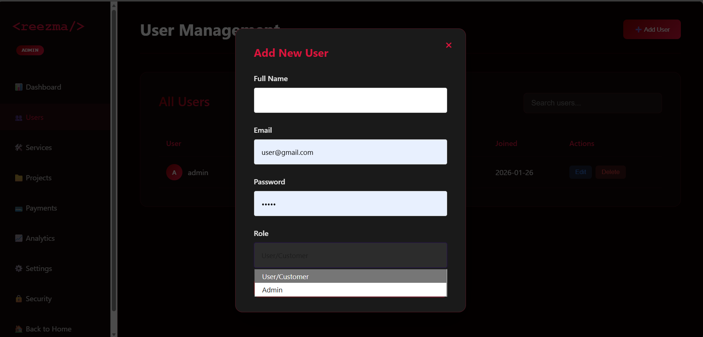
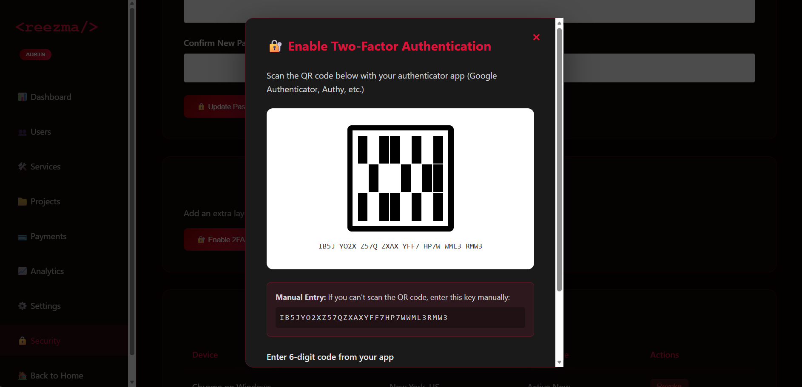

# Reezma Tech Services

<p align="center">
  <strong>Professional IT Solutions for Modern Businesses</strong>
</p>

<p align="center">
  A modern, responsive enterprise website built with HTML, CSS, and JavaScript featuring dark red theme, smooth animations, and professional design.
</p>

---

## 📋 Overview

**Reezma Tech Services** is a professional, full-featured IT services website showcasing cloud solutions, cybersecurity, data analytics, and custom development services. Built with modern web technologies and optimized for all devices.

🔴 **Brand Colors:** Dark red and crimson theme for professional corporate identity  
📱 **Fully Responsive:** Optimized for desktop, tablet, and mobile devices  
⚡ **Performance Focused:** Fast loading with clean, optimized code  

---

## 📸 Screenshots

### Homepage (index.html)
<p align="center">
  
</p>

*Features: Hero section with animated particles, statistics counter, project portfolio, client testimonials, and contact form*

---

### Services Page (services.html)
<p align="center">
  
</p>

*Features: Comprehensive service offerings, pricing cards, and detailed feature lists*

---

### Industries Page (industries.html)
<p align="center">
  
</p>

*Features: Industry-specific solutions and case studies*

---

### Login Page (login.html)
<p align="center">
  
</p>

*Features: Split-screen design with role-based authentication*

---

### User Dashboard (dashboard.html)
<p align="center">
  
</p>

*Features: Personal analytics, project overview, and user statistics*

---

### Admin Dashboard (admin.html)

#### Dashboard Overview
<p align="center">
  
</p>

*Features: Real-time system monitoring, live statistics, and activity feed*

#### Analytics Section
<p align="center">
  
</p>

*Features: Interactive Chart.js visualizations - Revenue overview, User growth, Project distribution*

#### User Management
<p align="center">
  
</p>

*Features: Complete CRUD operations, search functionality, role management*

#### Two-Factor Authentication
<p align="center">
  
</p>

*Features: QR code setup, backup codes generation, secure account protection*

---

### 📱 Mobile Responsive Design

<p align="center">
  
</p>

*Fully optimized for all devices - from 360px (small phones) to 1600px+ (large desktops)*

<details>
<summary>View More Mobile Screenshots</summary>

<p align="center">
  
  
  
</p>

</details>

---

## ✨ Features

### Core Website Features
- **Modern Design:** Professional dark red theme with gradient effects
- **Fully Responsive:** Seamless experience across all screen sizes (1600px to 360px)
- **Interactive Components:** Smooth animations, hover effects, and transitions
- **Multi-Page Structure:** Home, Services, Industries, Login, Dashboard, and Admin pages
- **Contact Form:** Professional contact section with Formspree integration
- **Statistics Section:** Animated counters showcasing achievements
- **Client Testimonials:** 5-star ratings and customer reviews
- **Project Portfolio:** Showcase of completed projects with detailed information
- **Social Media Integration:** LinkedIn, Twitter, Instagram, YouTube links
- **Clean Code:** Well-organized HTML, CSS, and JavaScript

### Advanced Admin Dashboard Features
- **🎯 Real-Time System Monitoring**
  - Live CPU, Memory, and Disk usage tracking
  - Auto-refresh every 3 seconds with visual progress bars
  - System health indicators (Normal/High/Critical)
  - Database size and API response time tracking
  - Active sessions and network status monitoring
  - System uptime calculator with request tracking

- **👥 User Management**
  - Complete CRUD operations for users
  - Role assignment (Admin/User)
  - User search and filtering
  - Status tracking (Active/Inactive)
  - User avatars with initials

- **📁 Project Management**
  - Create, edit, and delete projects
  - Progress tracking with visual bars
  - Budget and deadline management
  - Status workflow (Planning → In Progress → Review → Completed)
  - Client association

- **🛠️ Services Management**
  - Service catalog with pricing
  - Category organization (Web, Mobile, Design, Consulting)
  - Add/Edit/Delete services
  - Description and pricing management

- **💳 Payment Management**
  - Transaction history tracking
  - Payment status monitoring (Completed/Pending)
  - Revenue statistics dashboard
  - Payment export functionality
  - Client-project linkage

- **📊 Analytics & Charts**
  - Revenue overview (Line Chart)
  - User growth tracking (Bar Chart)
  - Project status distribution (Doughnut Chart)
  - Real-time data from localStorage
  - Interactive Chart.js visualizations
  - Comprehensive report generation

- **🔒 Security Features**
  - Two-Factor Authentication (2FA)
  - QR code generation for authenticator apps
  - 8 backup codes for account recovery
  - Password change functionality
  - Active session management
  - Session revocation capability

- **⚙️ Settings Management**
  - Company information
  - Email notification preferences
  - Timezone configuration
  - System configuration options

- **📱 Responsive Design**
  - Mobile-optimized sidebar navigation
  - Touch-friendly interactions
  - Adaptive grid layouts
  - Collapsible menu for mobile devices

### Data Persistence
- **LocalStorage Integration:** All admin data persists across sessions
- **Sample Data Generation:** Auto-populates demo data on first load
- **Export Functionality:** Download reports and backup codes

---

## 🎯 Pages Included

- **index.html** - Homepage with hero section, stats, portfolio, testimonials, and contact form
- **services.html** - Comprehensive services showcase with detailed offerings
- **industries.html** - Industry-specific solutions and case studies
- **login.html** - Split-screen authentication with role-based access
- **signup.html** - User registration with form validation
- **dashboard.html** - User dashboard with personal analytics
- **admin.html** - Full-featured admin panel with real-time monitoring

### Admin Dashboard Sections

1. **📊 Dashboard** - System overview, live statistics, and recent activity
2. **👥 Users** - User management with search, add, edit, delete
3. **🛠️ Services** - Service catalog management
4. **📁 Projects** - Project tracking with progress monitoring
5. **💳 Payments** - Transaction history and revenue tracking
6. **📈 Analytics** - Interactive charts and business insights
7. **⚙️ Settings** - System configuration and preferences
8. **🔒 Security** - 2FA, password management, session control

---

## 🚀 Getting Started

### Prerequisites

- Any modern web browser (Chrome, Firefox, Safari, Edge)
- Text editor for modifications (VS Code recommended)

### Installation

1. **Clone this repository:**
   ```bash
   git clone https://github.com/reezmahanan/Reezma-tech-services.git
   ```

2. **Navigate to project folder:**
   ```bash
   cd Reezma-tech-services
   ```

3. **Open in browser:**
   - Double-click `index.html` to view locally
   - Or use Live Server extension in VS Code

### Admin Dashboard Access

To access the admin dashboard:

1. Open `login.html` in your browser
2. Use demo credentials:
   - **Email:** admin@reezmatech.com
   - **Password:** admin123
3. Navigate to Admin Panel
4. Explore all features:
   - Dashboard with live monitoring
   - User management
   - Project tracking
   - Analytics charts
   - 2FA setup (Security section)

**Note:** All data is stored locally in browser localStorage. Clear browser data to reset.

---

## 🎯 Admin Dashboard Usage

### Dashboard Overview
- View real-time system metrics (CPU, Memory, Disk)
- Monitor active sessions and API response times
- Track system uptime and request statistics
- View recent activity feed

### Managing Users
1. Navigate to **Users** section
2. Click **Add User** button
3. Fill in user details (name, email, password, role)
4. Search users using the search bar
5. Edit or delete users as needed

### Creating Projects
1. Go to **Projects** section
2. Click **New Project**
3. Enter project details:
   - Name, Client, Budget
   - Deadline, Status
4. Track progress with visual bars
5. Update status through workflow

### Generating Analytics Reports
1. Visit **Analytics** section
2. View interactive charts:
   - Revenue overview (monthly trends)
   - User growth (bar chart)
   - Project status distribution
3. Click **Generate Report** for detailed insights

### Enabling Two-Factor Authentication
1. Open **Security** section
2. Click **Enable 2FA**
3. Scan QR code with authenticator app (Google Authenticator, Authy)
4. Enter 6-digit verification code
5. Save the 8 backup codes securely
6. Download codes as text file

---

## 📁 Project Structure

```
Reezma-tech-services/
├── index.html          # Homepage with hero, stats, projects, contact
├── services.html       # Services showcase page
├── industries.html     # Industry solutions page
├── login.html          # Authentication page
├── signup.html         # User registration page
├── dashboard.html      # User dashboard
├── admin.html          # Admin panel with analytics
├── Reezstyle.css       # Main stylesheet (comprehensive)
├── script.js           # JavaScript functionality
├── images/             # Project images and assets
│   ├── projects/       # Project portfolio images
│   └── screenshots/    # Website page screenshots
│       ├── homepage.png
│       ├── services.png
│       ├── industries.png
│       ├── login.png
│       ├── dashboard.png
│       ├── admin-dashboard.png
│       ├── admin-analytics.png
│       ├── admin-users.png
│       ├── admin-2fa.png
│       ├── mobile-responsive.png
│       ├── mobile-homepage.png
│       ├── mobile-services.png
│       └── mobile-admin.png
└── README.md           # Documentation
```

### Key Files

- **admin.html (2400+ lines)** - Complete admin dashboard with:
  - Real-time system monitoring
  - Chart.js integration for analytics
  - Full CRUD operations
  - 2FA implementation
  - Modal-based forms
  - LocalStorage data management

---

## 🎨 Customization

### Color Scheme

The website uses CSS variables defined in `Reezstyle.css`:

```css
:root {
    --primary: #8B0000;     /* Dark red */
    --accent: #DC143C;      /* Crimson */
    --dark: #0f1218;        /* Background */
    --light: #ffffff;       /* Text */
    --gradient: linear-gradient(135deg, #8B0000 0%, #DC143C 100%);
}
```

### Adding Services

Edit the services section in `services.html` or modify the stats in `index.html` to customize content.

### Extending Admin Features

The admin dashboard is built with modular JavaScript functions:

```javascript
// Add new metrics to system monitoring
function updateSystemMetrics() {
    // Add your custom monitoring logic
}

// Create custom chart
function renderCustomChart() {
    const ctx = document.getElementById('chart-id');
    new Chart(ctx, {
        type: 'line',
        data: { /* your data */ },
        options: { /* your options */ }
    });
}
```

### Sample Data Structure

```javascript
// User object
{
    name: 'John Doe',
    email: 'john@example.com',
    password: 'hashed_password',
    role: 'admin', // or 'user'
    status: 'Active',
    joined: '2026-01-15'
}

// Project object
{
    name: 'Project Name',
    client: 'Client Name',
    budget: 50000,
    deadline: '2026-06-30',
    status: 'in-progress',
    progress: 65
}
```

---

## 🔧 Technical Stack

### Frontend
- **HTML5** - Semantic markup with accessibility features
- **CSS3** - Grid, Flexbox, animations, custom properties, responsive design
- **JavaScript (ES6+)** - Modern syntax, modules, async operations
- **Chart.js v4.4.1** - Interactive data visualizations
- **Formspree** - Contact form backend integration

### JavaScript Libraries
- **Chart.js** - Revenue, user growth, and status distribution charts
- **LocalStorage API** - Client-side data persistence
- **Intersection Observer** - Scroll-based animations

### Design Patterns
- Responsive web design (mobile-first approach)
- Component-based architecture
- State management with localStorage
- Modal dialogs for user interactions
- Toast notifications for feedback

### Browser Compatibility

✅ Chrome (latest)  
✅ Firefox (latest)  
✅ Safari (latest)  
✅ Edge (latest)  
✅ Mobile browsers (iOS Safari, Android Chrome)

---

## 📱 Responsive Breakpoints

- **1600px** - Extra large desktops
- **1400px** - Large desktops
- **1200px** - Standard desktops
- **1024px** - Tablets landscape
- **768px** - Tablets portrait
- **640px** - Large phones
- **480px** - Standard phones
- **360px** - Small phones

---

## 🚀 Performance & Optimization

- **Lazy Loading:** Images load on demand for faster initial load
- **CSS Animations:** Hardware-accelerated transitions
- **Efficient JavaScript:** Event delegation and debouncing
- **LocalStorage Caching:** Reduced server requests
- **Minified Assets:** Optimized CSS and JS (when deployed)
- **Progressive Enhancement:** Works without JavaScript for basic functionality

### Admin Dashboard Performance
- Real-time monitoring with 3-second intervals
- Auto-cleanup when switching sections
- Efficient chart rendering with Chart.js
- Modal-based interactions to prevent page reloads
- Toast notifications instead of blocking alerts

---

## 🎨 Design Features

### Visual Elements
- **Gradient Backgrounds:** Smooth crimson red gradients
- **Glassmorphism:** Frosted glass effect on cards
- **Particle Effects:** Animated background particles
- **Smooth Scrolling:** Elegant page navigation
- **Hover Animations:** Interactive element responses
- **Progress Bars:** Visual feedback for metrics
- **Status Badges:** Color-coded indicators
- **Pulsing Effects:** Live system status

### Typography
- **Primary Font:** System fonts for optimal performance
- **Monospace:** Code and data displays
- **Font Weights:** 400 (regular), 600 (semi-bold), 700 (bold)
- **Responsive Sizing:** Scales across breakpoints

---

## 🤝 Contributing

Contributions are welcome! Feel free to submit pull requests or open issues.

1. Fork the project
2. Create your feature branch (`git checkout -b feature/AmazingFeature`)
3. Commit your changes (`git commit -m 'Add some AmazingFeature'`)
4. Push to the branch (`git push origin feature/AmazingFeature`)
5. Open a Pull Request

---

## ⭐ Show Your Support

If you find this project useful:

- ⭐ Star the repository
- 🔄 Fork it for your own projects
- 📢 Share with others
- 🐛 Report bugs or request features
- 💡 Suggest new admin features

---

## 🔮 Roadmap & Future Enhancements

- [ ] Backend API integration (Node.js/Python)
- [ ] Real database connection (MongoDB/PostgreSQL)
- [ ] User authentication with JWT
- [ ] Real-time WebSocket notifications
- [ ] Advanced analytics with more chart types
- [ ] Export data to Excel/CSV
- [ ] Email notification system
- [ ] Multi-language support (i18n)
- [ ] Dark/Light theme toggle
- [ ] Advanced search and filtering
- [ ] Drag-and-drop file uploads
- [ ] Calendar integration for project deadlines

---

## 📊 Project Statistics

- **Lines of Code:** 2400+ (admin.html), 800+ (script.js), 1500+ (Reezstyle.css)
- **Total Features:** 50+ implemented features
- **Admin Sections:** 8 comprehensive sections
- **Charts:** 3 interactive Chart.js visualizations
- **Modals:** 6 functional modal dialogs
- **Responsive Breakpoints:** 8 optimized breakpoints
- **Browser Compatible:** 5+ major browsers

---

## � Adding Screenshots

To populate the screenshots in this README:

### 1. Take Screenshots
- Open each page in your browser
- Use browser screenshot tools or press `PrtScn`
- Recommended size: 1920x1080 for desktop views
- For mobile: 375x812 (iPhone size) or similar

### 2. Name Your Files
Save screenshots with these exact names in `images/screenshots/`:
- `homepage.png` - Homepage (index.html)
- `services.png` - Services page
- `industries.png` - Industries page
- `login.png` - Login page
- `dashboard.png` - User dashboard
- `admin-dashboard.png` - Admin dashboard overview
- `admin-analytics.png` - Admin analytics section
- `admin-users.png` - Admin user management
- `admin-2fa.png` - 2FA setup modal
- `mobile-responsive.png` - Multiple mobile views combined
- `mobile-homepage.png` - Mobile homepage
- `mobile-services.png` - Mobile services
- `mobile-admin.png` - Mobile admin view

### 3. Optimize Images (Optional)
```bash
# Install imagemin-cli (optional, for optimization)
npm install -g imagemin-cli

# Optimize screenshots
imagemin images/screenshots/*.png --out-dir=images/screenshots/
```

### 4. Commit and Push
```bash
git add images/screenshots/
git commit -m "docs: Add website screenshots to README"
git push origin main
```

---

## �📬 Contact

**Reezma Tech Services**

- GitHub: [@reezmahanan](https://github.com/reezmahanan)
- Repository: [Reezma-tech-services](https://github.com/reezmahanan/Reezma-tech-services)

---

## 📄 License

This project is available for personal and commercial use.

---

Made with ❤️ and dedication to quality code

**Latest Update:** February 2026 - Complete Admin Dashboard with Real-time Monitoring, Analytics Charts, and 2FA Security

© 2026 Reezma Tech. All rights reserved.